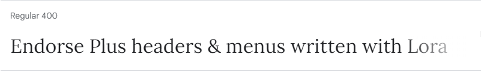
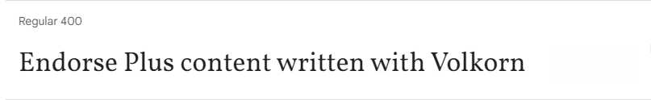
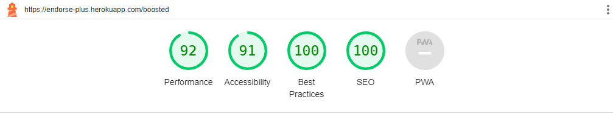

# ENDORSE PLUS <!-- omit from toc -->

<kbd></kbd>

**Developer:** [**Khubab Shamsuddin**](https://www.linkedin.com/in/kshamse/)

[**Live Site URL**](https://endorse-plus.herokuapp.com/)

# Table of Contents
- [Table of Contents](#table-of-contents)
- [Overview](#overview)
- [Goals](#goals)
- [User Stories](#user-stories)
- [Design](#design)
  - [Colours and Fonts](#colours-and-fonts)
  - [Mockups](#mockups)
- [Technologies Used](#technologies-used)
  - [Languages](#languages)
  - [Libraries](#libraries)
  - [Other Software and Tools](#other-software-and-tools)
- [Implementation](#implementation)
  - [Front-End](#front-end)
  - [Back-End](#back-end)
- [Features](#features)
  - [Existing Features](#existing-features)
  - [Features Left to Implement](#features-left-to-implement)
- [Validation](#validation)
- [Testing](#testing)
- [Configurations](#configurations)
- [Credit](#credit)

# Overview
Endorse Plus is a platform where professionals can provide evidence-based recommendations and endorsements to each other. Everyone can request recommendations privately. Users can boost recommendations on each other's profiles to increase the authenticity level of the endorsement. Endorse Plus is a site where professionals can know more about each other skills and potential.

[*Back to Top*](#table-of-contents)

# Goals

## User's Goals <!-- omit from toc -->

1. Exchange recommendations based on work-based qualities and skills. 
2. Support and promote current or previous colleagues by sending and boosting recommendations.
3. Search for new talented professionals who are endorsed and boosted.

## Site Onwer's Goals <!-- omit from toc -->

1. Build a platform that fosters support and promotion.
2. Develop a site with straightforward use and considerable impact. 

[*Back to Top*](#table-of-contents)

# User Stories

## Anonymous User <!-- omit from toc -->

1. I can create an account so that I can request, send, and receive recommendations. (Must Have)
2. I can sign in to my account so that I can manage my requests and recommendation. (Must Have)
3. I can see the top-endorsed profiles so that I can get to know trending profiles. (Should Have)

## Logged-in User <!-- omit from toc -->

4.  I can create a recommendation so that I help other users gain professional endorsements. (Must Have)
5. I can access all recommendations so that I can update or delete sent recommendations or locate and read others' recommendations. (Must Have)
6. I can update a recommendation so that I can add or remove information. (Must Have)
7. I can feature a received recommendation so that it appears on top of my profile. (Could Have)
8. I can boost or un-boost others' recommendations so that I can affect the authenticity of a recommendation. (Must Have)
9.  I can delete a recommendation so that I pull back a given recommendation. (Must Have)
10. I can access boosted recommendations so that I can go back to them. (Should Have)
11. I can request others to recommend me so that I could gain more professional endorsements. (Must Have)
12. I can read the received requests and the ones I sent so that I could recommend others and expect others to recommend me based on my requests. (Must Have)
13. I can withdraw sent requests so that I pull back my request whenever I want. (Could Have)
14. I can update my profile data so that I will have my latest work information on it. (Must Have)

[*Back to Top*](#table-of-contents)

# Design

## Colours and Fonts

- The used colours and fonts on this site reflect the professional theme and provide the required contrast and clarity.

  
Colours

  
Fonts

## Mockups

  
Home Page

  
Boosted Page

  
Requests Page

[*Back to Top*](#table-of-contents)

# Technologies Used

## Languages

- HTML 
- CSS
- Javascript
  
## Libraries

- [React](https://react.dev/) is used for building user interfaces as components and controlling the platform's business logic and handling users' actions.
- [Axios](https://www.npmjs.com/package/axios) is used to send various types of API queries to the backend server.
- [React Router](https://www.npmjs.com/package/react-router-dom) is used to implement a single-page application, handling navigation through the platform without needing to refresh the page.
- [React Bootstrap](https://react-bootstrap-v4.netlify.app/getting-started/introduction/) is used to enhance user interface responsiveness and styles.
- [React JWT Decode](https://www.npmjs.com/package/jwt-decode) is used to decode the authentication refresh token and stop the application from making unnecessary API requests.
- [React Infinite Scroll](https://www.npmjs.com/package/react-infinite-scroll-component) is used to load recommendations and requests automatically on user scrolling action.
- [MomentJs Library](https://momentjs.com/) is used to change React date input format to match the server format.

## Other Software and Tools

- [Visual Studio Code](https://code.visualstudio.com/) was used as a code editor to develop this project.
- [Gitpod](https://gitpod.io/) was used as an online development environment to develop and test this project.
- [Github](https://github.com/) was used to store the code of this project.
- [Heroku](https://www.heroku.com/) was used for the deployment of this platform's live site. 
- [Chrome dev tools](https://developer.chrome.com/docs/devtools/) were used to test and debug the code of the site. 
- [Lighthouse](https://developers.google.com/web/tools/lighthouse/) was used to test the site based on best practice aspects.
- [W3C Validator](https://validator.w3.org/) was used to validate HTML code.
- [Jigsaw Validator](https://jigsaw.w3.org/css-validator/) was used to validate CSS code.
- [Mockitt](https://mockitt.wondershare.com/) was used to create the sites' mockups.
- [Am I Responsive](https://ui.dev/amiresponsive) was used to generate multiple screen views of the site.
- [Google Fonts](https://fonts.google.com/) was used to import sites' fonts.
- [Font Awesome](https://fontawesome.com/) was used to import the icons on this site.
- [Canva](https://www.canva.com/) was used to create the logo and colours palette of this site.
- [Pexels](https://www.pexels.com) was used to download the users' profile photos
- [Freepik](https://www.freepik.com/) was used to download the error page icons. 
- [Favicon Converter](https://favicon.io/favicon-converter) was used to convert the created logo image to a favicon.
- [QuillBot](https://quillbot.com/) was used to check the grammar of the readme file.
- [Google Translate](https://translate.google.com/) was used to find translations needed for the readme file.
- [Grammarly](https://marketplace.visualstudio.com/items?itemName=znck.grammarly) was used to check the grammar of the readme file on VS Code.
- [Markdown All in One](https://marketplace.visualstudio.com/items?itemName=yzhang.markdown-all-in-one) was used to generate the table of contents and organise the readme file on VS Code.
- [Glean](https://marketplace.visualstudio.com/items?itemName=wix.glean) was used to extract React components to separate files.
- [VS Code ES7+ React/Redux/React-Native/JS snippets](https://marketplace.visualstudio.com/items?itemName=dsznajder.es7-react-js-snippets) was used mainly to shortcut the creation of the functional components.
- [Prettier](https://marketplace.visualstudio.com/items?itemName=esbenp.prettier-vscode) was used to format and organise the JSX code and files.
  
[*Back to Top*](#table-of-contents)

# Implementation
## Front-End

### React <!-- omit from toc -->

React is an open-source JavaScript library that is used for building user interfaces in a declarative and efficient way. It is a component-based front-end library responsible only for the view layer of an MVC (Model View Controller) architecture. React is used to create modular user interfaces and it promotes the development of reusable UI components that display dynamic data[*](https://www.geeksforgeeks.org/react-js-introduction-working/). React is well-known for it is reusability, flexibility, simplicity, ease of use, and available a wide range of community support. Many components were developed and reused throughout this project.
- Top-endorsed Profiles `<RecommendationsListPage />`: developed and used on the home page in addition to displaying it in the user's profile
- User's Avatar `<Avatar />`: reusable component used inside recommendation, request, and profile pages.
- Warning Alert `<CustomAlert />`: is used within the site forms to provide the user with the feedback necessary.
- Loading spinner `<Loader />`: is displayed in several places while the loading of the page content.
- Error Message `<ErrorMessage />`: is used in error pages to display an image, navigation options, and appropriate messages.

## Back-End

The backend side of this platform was built using the Django Rest Framework. Linked with the Postgresql database to store the data and deployed on Heroku.
[**(Backend Code Repository)**](https://github.com/kshamse/endorse-plus-backend)

[*Back to Top*](#table-of-contents)

# Features

## Existing Features

### Sign Up Form  <!-- omit from toc -->

- Developed to help users create accounts to access all the platform features.
- *User stories covered: 1*

  
Screenshot

### Sign In Form  <!-- omit from toc -->

- Users can use the sign-in page to access their recommendations and request.
- Only logged-in users can create recommendations and requests and boost recommendations.
- *User stories covered: 2*

  
Screenshot

### Top-Endorsed Profiles  <!-- omit from toc -->

- Users can see a list of the most recommended professionals' profiles on the home.
- *User stories covered: 3*

  
Screenshot

### Recommendation Form  <!-- omit from toc -->

- Users can recommend each other by visiting their profiles and clicking on the recommend user button.
- A recommendation form will be displayed to enter the content, recommended experience, and recommender relationship to the receiver.
- On the recommendation edit or update the same form will be displayed with the previously entered values.
- *User stories covered: 4, 6*

  
Screenshot

### Home Page - Recommendations Page  <!-- omit from toc -->
- Includes received and sent recommendations. 
- Contains all recommendations for anonymous users.
- Users can boost or un-boost recommendations.
- Only recommendations owners can delete or update them.
- The receiver or recommendation receiver can feature the recommendation so it could appear on the top of his/ her profile.
- *User stories covered: 5, 6, 7, 8, 9*

  
Screenshot

### Boosted Page  <!-- omit from toc -->
- Boosted page is like a journal of all recommendations boosted by the current user.
- Boosted page only appears for logged-in users.
- *User stories covered: 10*

  
Screenshot

### Request Form  <!-- omit from toc -->

- Users can request each other privately for a recommendation by visiting their profiles and clicking on the request user button.
- A request form will be displayed to enter the message.
- *User stories covered: 11*

  
Screenshot

### Requests Page  <!-- omit from toc -->
- Includes received and sent requests. 
- Only logged-in users can access their sent or received requests.
- The sender can only withdraw the request while the receiver can mark it as read or unread.
- *User stories covered: 12,13*

  
Screenshot

### Profile Page  <!-- omit from toc -->
- The profile page is the place where all the necessary information about the user is displayed.
- Users can update their name, summary, Linkedin profile link, and experiences.
- Users can see each other received or sent recommendations on the profile page.
- *User stories covered: 14*

  
Screenshot

## Features Left to Implement

- *Recommendation Badges* users can share a badge of a given recommendation on social or professional networks.
- *LinkedIn API Integration* users can sign up via Linkedin and all profile and experience data could be imported then.

[*Back to Top*](#table-of-contents)

# Validation

## [Lighthouse](https://developers.google.com/web/tools/lighthouse/) <!-- omit from toc -->
The Lighthouse tool is used to validate performance, accessibility, SEO and best practice aspects of this site and it generated reports as follows:

  
Home Page

  
Boosted Page

  
Requests Page

  
Profile Page

  
Recommendation Page

  
Request Page

## [W3C Validator](https://validator.w3.org/) <!-- omit from toc -->
Nu HTML Checker of the W3 Organisation was used to validate the HTML code of this project and reports were as follows:

  
Home Page

  
Boosted Page

  
Requests Page

  
Profile Page

  
Recommendation Page

  
Request Page

## [Jigsaw Validator](https://jigsaw.w3.org/css-validator/)  <!-- omit from toc -->
The Jigsaw of the W3 Organisation was used to validate the CSS code and discovered the issue was resolved.

  
Home Page

  
Boosted Page

  
Requests Page

  
Profile Page

  
Recommendation Page

  
Request Page

[*Back to Top*](#table-of-contents)

# Testing

## Manual Testing  <!-- omit from toc -->

__1. I can create an account so that I can request, send, and receive recommendations__

| Step                                                                   | Expected Result                                                                                                                                                    | Actual Result     |
| ---------------------------------------------------------------------- | ------------------------------------------------------------------------------------------------------------------------------------------------------------------ | ----------------- |
| Open https://endorse-plus.herokuapp.com/                               | `Home page` should be loaded.                                                                                                                                      | Works as expected |
| Click on the `Sign Up` link on the top navigation bar.                 | `Sign Up Form` should be loaded.                                                                                                                                   | Works as expected |
| User needs to enter the username, password, and password confirmation. | User should be forwarded to the `Sign In` page if the entry is successfully done otherwise a warning will be displayed with the reason for the submission failure. | Works as expected |

__2. I can sign in to my account so that I can manage my requests and recommendation__

| Step                                                                                | Expected Result                                                                                                                                                 | Actual Result     |
| ----------------------------------------------------------------------------------- | --------------------------------------------------------------------------------------------------------------------------------------------------------------- | ----------------- |
| Click on the `Sign In` link on the top navigation bar.                              | `Sign In Form` should be loaded.                                                                                                                                | Works as expected |
| User needs to enter the username and password provided in the registration process. | User should be forwarded to the `Home` page if the entry is successfully done otherwise a warning will be displayed with the reason for the submission failure. | Works as expected |

__3. I can see the top-endorsed profiles so that I can get to know trending profiles__

| Step                                                | Expected Result                                                                                                                                                                       | Actual Result     |
| --------------------------------------------------- | ------------------------------------------------------------------------------------------------------------------------------------------------------------------------------------- | ----------------- |
| Click on the `Home` link on the top navigation bar. | `Home page` should be loaded including the top endorsed profile on the right side (on desktops and tablets) or the top of the home page below the navigation bar (on mobile devices). | Works as expected |

__4.  I can create a recommendation so that I help other users gain professional endorsements__

| Step                                                                                                                                                 | Expected Result                                                                      | Actual Result     |
| ---------------------------------------------------------------------------------------------------------------------------------------------------- | ------------------------------------------------------------------------------------ | ----------------- |
| After signing in go to the user profile URL `https://endorse-plus.herokuapp.com/profiles/{profile_id}`.                                              | `Profile page` should be loaded.                                                     | Works as expected |
| Click on the `Recommend User` button below the name of the user.                                                                                     | `Recommendation Form` should load                                                    | Works as expected |
| Enter the related experience needed to recommend the user for, and work relationship with the recommendee in addition to the recommendation content. | `Recommendation` should be submitted and the user should be forwarded to it is page. | Works as expected |

__5. I can access all recommendations so that I can update or delete sent recommendations or locate and read others' recommendations__

| Step                                                                                                        | Expected Result                                                                                                                                | Actual Result     |
| ----------------------------------------------------------------------------------------------------------- | ---------------------------------------------------------------------------------------------------------------------------------------------- | ----------------- |
| Click on the `Home` link on the top navigation bar.                                                         | `Home page` should be loaded and includes tabs of sent and received recommendations if the user is logged in or all recommendations otherwise. | Works as expected |
| Users can click on the `Delete` or `Edit` buttons on their sent recommendations or `Feature` received ones. | an Alert of delete confirmation in case of the deletion. `Recommendation Form` should be loaded if the edit button is pushed.                  | Works as expected |

__6. I can update a recommendation so that I can add or remove information__

| Step                                                                                | Expected Result                                                                                          | Actual Result     |
| ----------------------------------------------------------------------------------- | -------------------------------------------------------------------------------------------------------- | ----------------- |
| Click on the `Edit` button on the top right of the recommendation needed to update. | `Recommendation Form` should load                                                                        | Works as expected |
| Enter the new recommendation data needed to update or add.                          | `Recommendation` should be updated if the entry is successful otherwise a warning message will be shown. | Works as expected |

__7. I can feature a received recommendation so that it appears on top of my profile__

| Step                                                                                      | Expected Result                                                                                                                                 | Actual Result     |
| ----------------------------------------------------------------------------------------- | ----------------------------------------------------------------------------------------------------------------------------------------------- | ----------------- |
| Click on the `Feature` button on the bottom left of the recommendation needed to feature. | Feature button should be shown as clicked. Featured recommendations should appear on the user profile on top of other received recommendations. | Works as expected |

__8. I can boost or un-boost others' recommendations so that I can affect the authenticity of __a recommendation__

| Step                                                                                                        | Expected Result                                                                                                 | Actual Result     |
| ----------------------------------------------------------------------------------------------------------- | --------------------------------------------------------------------------------------------------------------- | ----------------- |
| Click on the `Boost` or `Un Boost` buttons on the bottom left of the recommendation needed to update boost. | Boost button should be updated as clicked or not. The boosted recommendation should appear on the boosted page. | Works as expected |

__9.  I can delete a recommendation so that I pull back a given recommendation__

| Step                                                                                  | Expected Result                                                                         | Actual Result     |
| ------------------------------------------------------------------------------------- | --------------------------------------------------------------------------------------- | ----------------- |
| Click on the `Delete` button on the top right of the recommendation needed to delete. | Confirmation alert should be shown.                                                     | Works as expected |
| Click on `OK` to confirm the recommendation deletion decision.                        | `Recommendation` should be deleted and the user should be forwarded to the `Home Page`. | Works as expected |

__10. I can access boosted recommendations so that I can go back to them__

| Step                                                   | Expected Result                                                           | Actual Result     |
| ------------------------------------------------------ | ------------------------------------------------------------------------- | ----------------- |
| Click on the `Boosted` link on the top navigation bar. | `Boosted page` should be loaded and includes all boosted recommendations. | Works as expected |

__11. I can request others to recommend me so that I could gain more professional endorsements__

| Step                                                                                                    | Expected Result                                                               | Actual Result     |
| ------------------------------------------------------------------------------------------------------- | ----------------------------------------------------------------------------- | ----------------- |
| After signing in go to the user profile URL `https://endorse-plus.herokuapp.com/profiles/{profile_id}`. | `Profile page` should be loaded.                                              | Works as expected |
| Click on the `Request Recommendation` User button below the name of the user.                           | `Request Form` should load                                                    | Works as expected |
| Enter the request message need to send.                                                                 | `Request` should be submitted and the user should be forwarded to it is page. | Works as expected |

__12. I can read the received requests and the ones I sent so that I could recommend others and expect others to recommend me based on my requests__

| Step                                                    | Expected Result                                                          | Actual Result     |
| ------------------------------------------------------- | ------------------------------------------------------------------------ | ----------------- |
| Click on the `Requests` link on the top navigation bar. | `Requests page` should be loaded to include all boosted recommendations. | Works as expected |

__13. I can withdraw sent requests so that I pull back my request whenever I want__

| Step                                                                             | Expected Result                     | Actual Result     |
| -------------------------------------------------------------------------------- | ----------------------------------- | ----------------- |
| Click on the `Withdraw` button on the top right of the request needed to delete. | Confirmation alert should be shown. | Works as expected |
| Click on `OK` to confirm the request deletion decision.                          | `Request` should be deleted.        | Works as expected |

__14. I can update my profile data so that I will have my latest work information on it__

| Step                                                                                                            | Expected Result                                                                                                                                   | Actual Result     |
| --------------------------------------------------------------------------------------------------------------- | ------------------------------------------------------------------------------------------------------------------------------------------------- | ----------------- |
| Click on the `Avatar Image` link on the top navigation bar.                                                     | `Profile page` should be loaded and includes tabs of sent and received recommendations if the user is logged in or all recommendations otherwise. | Works as expected |
| Click on the `Edit` button near the profile image.                                                              | `Profile Form` should load                                                                                                                        | Works as expected |
| Enter the new title, summary, and LinkedIn profile link data or update the name and click on the `Save` button. | `Profile` should be updated if the entry is successful otherwise a warning message will be shown.                                                 | Works as expected |

[*Back to Top*](#table-of-contents)

# Configurations

## Fork This Repository <!-- omit from toc -->

  
What is the procedure for forking this repository?

1. Click the `Fork button` in the top right corner of this page.
2. On `Create a new fork` adjust the repository `name` and `description` if necessary.
3. select `Create fork`.

## Make Local Clone <!-- omit from toc -->

  
How to create a local clone of this repository?

1. Click the `<> Code` button at the top of this page.
2. Choose `HTTPS` from the drop-down menu.
3. To copy the URL, click on the `clipboard button`.
4. Open the terminal where you wish to clone the repository on your PC.
Enter the command: `git clone [copied URL]` and enter the Github account `username` and `password` and press Enter.

[*Back to Top*](#table-of-contents)

# Credit

- This project was developed following the [Code Institute's Moments walkthrough project](https://github.com/Code-Institute-Solutions/moments/tree/master).
- [React Bootstrap documentation](https://react-bootstrap-v4.netlify.app/components/) used to understand and use the needed bootstrap components.
- Fonts used in this site were inspired by [Visme](https://visme.co/blog/elegant-fonts/) and [Typewolf](https://www.typewolf.com/vollkorn) articles and imported from [Google Fonts](https://fonts.google.com/).
- Using spread operators inside useState inspired by [owdji](https://stackoverflow.com/questions/70507395/create-an-array-of-objects-with-usestate-and-spread-syntax) and [codmitu](https://stackoverflow.com/questions/72225342/how-to-add-items-to-array-in-react) answers.
- Promise all use was based on [Siddhant's](https://stackoverflow.com/questions/67073886/how-to-combine-multiple-api-requests-in-one-function-with-fetch-in-react) answer.
- Users' profile avatars for [Jane](https://www.pexels.com/photo/photo-of-a-woman-smiling-1520760/) and [John](https://www.pexels.com/photo/smiling-man-with-laptop-and-eyeglasses-7752846/) were downloaded from the [Pexels](https://www.pexels.com) website.
- Error icons for [not found](https://www.freepik.com/icon/404-error_1078490) and [un authorised](https://www.freepik.com/icon/computer_6358087) pages were downloaded from [Freepik](https://www.freepik.com/) website.
- Alert call in react is based on [RIYAJ KHAN's](https://stackoverflow.com/questions/52034868/confirm-window-in-react) answer.
- a submit button in React outside the form is inspired by [Pavlo Kyrylenko's](https://stackoverflow.com/questions/52577141/how-to-submit-form-from-a-button-outside-that-component-in-react) answer.
- Getting the value of an added attribute on a selection option is based on [squgeim's](https://stackoverflow.com/questions/43222540/get-selected-option-attribute-in-react) answer.
- Favicon converter using [Favicon Converter](https://favicon.io/favicon-converter/).
- Profile page code is taken from the Bootstrap 5 Profile card code of [Upasana Chauhan's](https://bbbootstrap.com/snippets/bootstrap-5-profile-card-animation-74461039).
- Changing the React date format was inspired by [Mr. Ratnadeep's](https://stackoverflow.com/questions/50960984/date-formatting-within-react-bootstrap-table) answer and developed using [MomentJs Library](https://momentjs.com/).
- Making a link routing to an external site is an idea from [Víctor Daniel's](https://stackoverflow.com/questions/42914666/react-router-external-link) answer.
- Fixing `SyntaxError: Cannot use import statement outside a module` by downgrading the Axios library version is based on this [Github issue](https://github.com/axios/axios/issues/5185)
- Recommendations content is taken from [Request Letters](https://requestletters.com/home/how-to-write-a-short-recommendation-letter-with-sample).
- Duties content is taken from [Great Sample Resume's](https://www.greatsampleresume.com/job-responsibilities/computer-software/associate-engineer) and [Glassdoor's](https://www.glassdoor.com/Career/software-manager-career_KO0,16.htm) articles.

[*Back to Top*](#table-of-contents)

